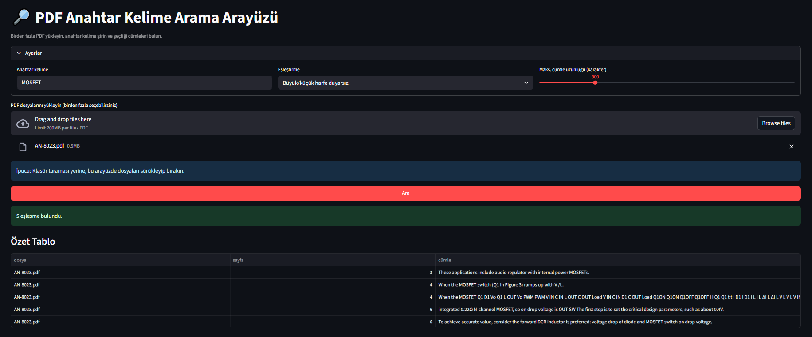

# 🔎 PDF Keyword Search Interface

This project is a **Streamlit-based** interface that facilitates keyword searching within PDF files.  
You can search for specific words in uploaded PDFs, find sentences containing those words, view results in a table format, and download them as **CSV / TXT (log)** files.
 

## 🚀 Features
- Upload and search multiple PDF files  
- Case-sensitive or case-insensitive search options  
- Automatic sentence splitting for improved readability  
- View results in table + context view  
- Export results in CSV and TXT formats  

## 📦 Installation

After cloning the project or downloading the files, install the required packages:

```bash
pip install -r requirements.txt
```

## ▶️ Running the Application

```bash
streamlit run pdf_ara_streamlit.py
```

After running the command, the interface will automatically open in your browser.

## 🖥️ Usage
1. **Upload PDF files** (drag-and-drop or file selection).  
2. **Enter the keyword** you want to search for.  
3. Adjust case sensitivity and maximum sentence length settings.  
4. Click the **Search** button.  
5. View results in table format, examine in context, and download if needed.  

## 📂 Files
- `pdf_ara_streamlit.py` → Main application code  
- `requirements.txt` → List of dependencies  

## 📝 Example Output
After searching, table and context view:

```
File: example.pdf | Page: 5
... sentence containing the **keyword** appears here ...
```

---

This tool is useful for researchers, engineers, or anyone who needs to quickly search for words across multiple PDF documents.
